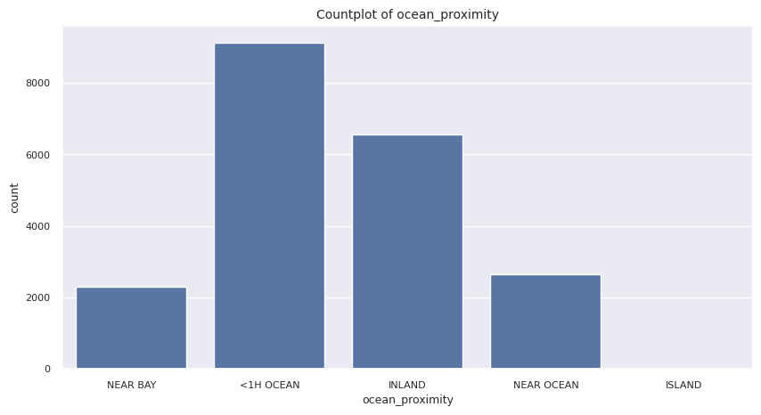
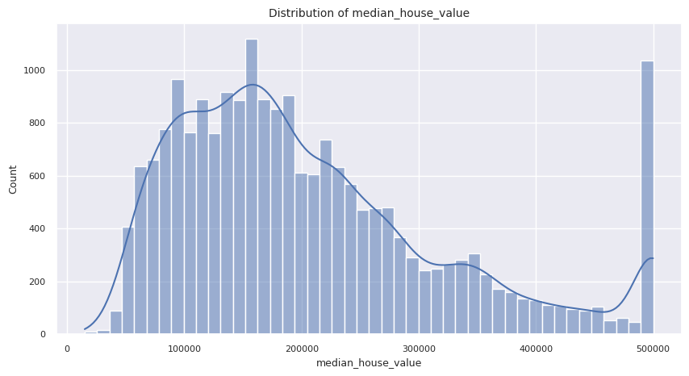
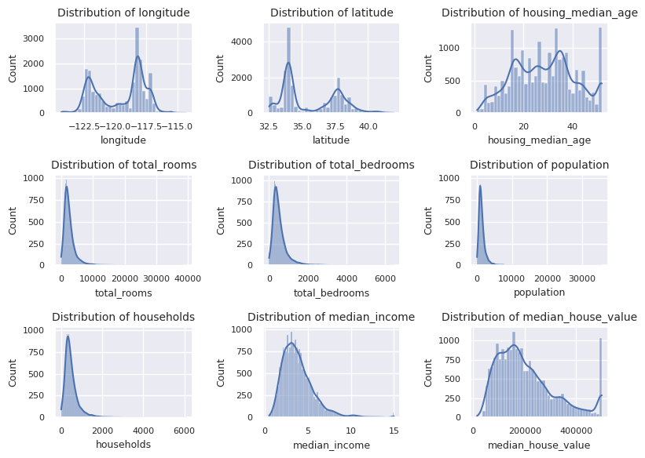
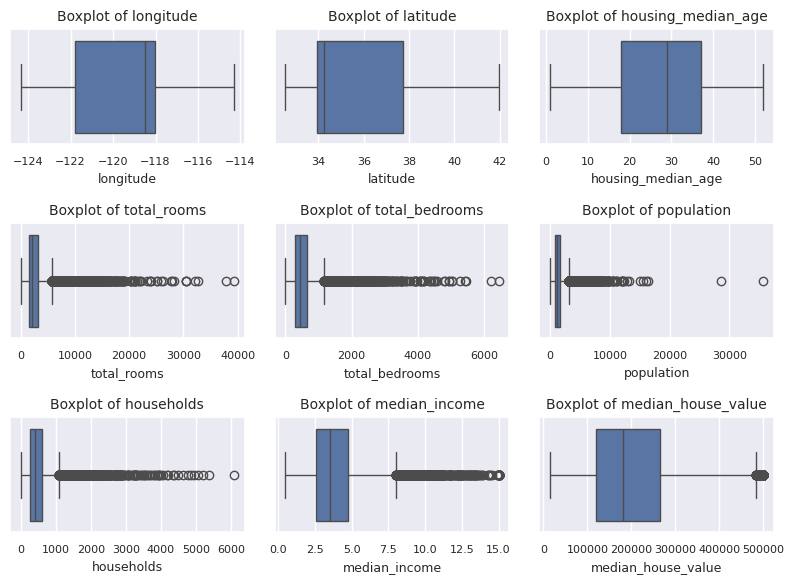
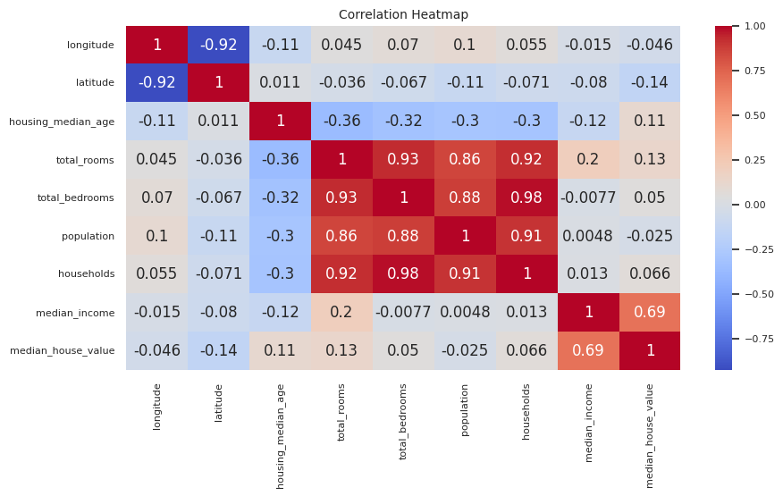

# 🏠 House Price Prediction

A machine learning project that predicts median house values in California districts using the classic **California Housing dataset**. The project covers the full ML workflow — exploratory data analysis, preprocessing, model comparison, hyperparameter tuning, and a ready-to-use prediction function.

## 📊 Overview

- **Type:** Regression
- **Target variable:** `median_house_value`
- **Best model:** `HistGradientBoostingRegressor` (scikit-learn)
- **Final test performance:** RMSE ≈ **46,242** | MAE ≈ **30,949** | R² ≈ **0.84**

## 📁 Dataset

The dataset (`housing (1).csv`) contains 20,640 rows and 10 columns describing California housing districts from the 1990 census, including:

| Column | Description |
|---|---|
| `longitude`, `latitude` | Geographic coordinates |
| `housing_median_age` | Median age of houses in the district |
| `total_rooms`, `total_bedrooms` | Total rooms/bedrooms in the district |
| `population`, `households` | Population and household counts |
| `median_income` | Median income of households (in tens of thousands USD) |
| `ocean_proximity` | Categorical proximity to the ocean |
| `median_house_value` | **Target** — median house value (USD) |

> Note: `total_bedrooms` has 207 missing values, handled via median imputation.

## 🔍 Exploratory Data Analysis

Key insights uncovered during EDA:
- No duplicate rows in the dataset.
- `median_house_value` is capped at 500,001, which may bias predictions for high-end homes.
- `median_income` shows the strongest positive correlation (0.688) with house value.
- Distribution plots, boxplots (outlier check), and a correlation heatmap were used to understand feature relationships.

### Categorical Feature: `ocean_proximity`


The dataset is dominated by districts labeled `<1H OCEAN` (~9,100) and `INLAND` (~6,600), with far fewer `NEAR OCEAN` (~2,600) and `NEAR BAY` (~2,300) districts, and only a handful of `ISLAND` records — a strong class imbalance that one-hot encoding must account for.

### Target Variable: `median_house_value`


The target is right-skewed with a large spike at the ~$500,000 cap, confirming the capping issue noted above — a meaningful number of high-value districts are clipped to this ceiling rather than reflecting their true value.

### Distribution of Numerical Features


Most count-based features (`total_rooms`, `total_bedrooms`, `population`, `households`) are heavily right-skewed with long tails, while `longitude`, `latitude`, and `housing_median_age` show multi-modal patterns reflecting distinct geographic clusters (e.g., Los Angeles and the Bay Area).

### Outlier Detection


Boxplots reveal significant outliers in `total_rooms`, `total_bedrooms`, `population`, and `households`, consistent with their skewed distributions above. `median_house_value` also shows a cluster of outliers at its capped upper bound.

### Correlation Heatmap


Key relationships:
- `median_income` has the strongest correlation with `median_house_value` (**0.69**).
- `total_rooms`, `total_bedrooms`, `population`, and `households` are highly inter-correlated (0.86–0.98), as expected since they all scale with district size.
- `longitude` and `latitude` are strongly negatively correlated (**-0.92**), reflecting California's geographic orientation.

## ⚙️ Preprocessing Pipeline

Built using `scikit-learn`'s `ColumnTransformer` and `Pipeline`:

- **Numerical features:** median imputation → standard scaling
- **Categorical features (`ocean_proximity`):** most-frequent imputation → one-hot encoding

## 🤖 Model Selection

Five regression models were evaluated using 5-fold cross-validation (`RMSE`, `MAE`, `R²`):

| Model |
|---|
| Linear Regression |
| Lasso |
| Ridge |
| Random Forest |
| HistGradientBoosting ⭐ (best) |

`HistGradientBoostingRegressor` achieved the lowest cross-validated RMSE and was selected for hyperparameter tuning.

## 🎯 Hyperparameter Tuning

`GridSearchCV` was used to tune the `HistGradientBoostingRegressor` over parameters including learning rate, max iterations, max depth, min samples per leaf, L2 regularization, and max bins (486 candidate combinations, 5-fold CV → 2,430 fits).

**Best parameters found:**
```python
{
    'model__l2_regularization': 1.0,
    'model__learning_rate': 0.1,
    'model__max_bins': 255,
    'model__max_depth': None,
    'model__max_iter': 500,
    'model__min_samples_leaf': 50
}
```

## 📈 Final Results

| Metric | Train | Test |
|---|---|---|
| RMSE | — | 46,242.03 |
| MAE | — | 30,948.57 |
| R² | — | 0.84 |

Residual plots and distribution plots are included in the notebook to visually assess model errors.

## 🔮 Making Predictions

The notebook includes a ready-to-use prediction function:

```python
def house_price_predict(
    longitude: float,
    latitude: float,
    housing_median_age: float,
    total_rooms: float,
    total_bedrooms: float,
    population: float,
    households: float,
    median_income: float,
    ocean_proximity: str
) -> float:
    ...
```

**Example usage:**
```python
example = house_price_predict(
    longitude=-122.23,
    latitude=37.88,
    housing_median_age=41,
    total_rooms=880,
    total_bedrooms=129,
    population=322,
    households=126,
    median_income=8.3252,
    ocean_proximity="NEAR BAY"
)
print(round(example, 2))  # ➜ 435266.65
```

## 🛠️ Tech Stack

- Python 3
- pandas, numpy
- matplotlib, seaborn
- scikit-learn

## 🚀 Getting Started

1. Clone the repository
   ```bash
   git clone https://github.com/HiteshYadav2616/House_Price_Prediction.git
   cd House-Price-Prediction
   ```
2. Install dependencies
   ```bash
   pip install pandas numpy matplotlib seaborn scikit-learn jupyter
   ```
3. Add the dataset (`housing (1).csv`) to your working directory and update the file path in the notebook.
4. Open and run `House_Price_Prediction.ipynb`:
   ```bash
   jupyter notebook House_Price_Prediction.ipynb
   ```

> 💡 The original notebook was developed in Google Colab and mounts Google Drive to load the dataset. If running locally, replace the `drive.mount(...)` and file path cells with a local path to `housing (1).csv`.

## 📂 Project Structure

```
├── House_Price_Prediction.ipynb   # Main notebook: EDA, preprocessing, modeling, tuning
├── housing (1).csv                    # Dataset
├── countplot_cat_col.png
├── distribution_of_target_col.png
├── distribution_of_num_cols.png
├── boxplotof_num_cols.png
├── heatmap.png
├── test_data_reg_plot.png
├── train_data_basicReg_plot.png
├── residual_reg_plot.png
├── residual_distribution_plot.png
└── README.md                      # Project documentation
```

## 📄 License

This project is open source and available under the [MIT License](LICENSE).
